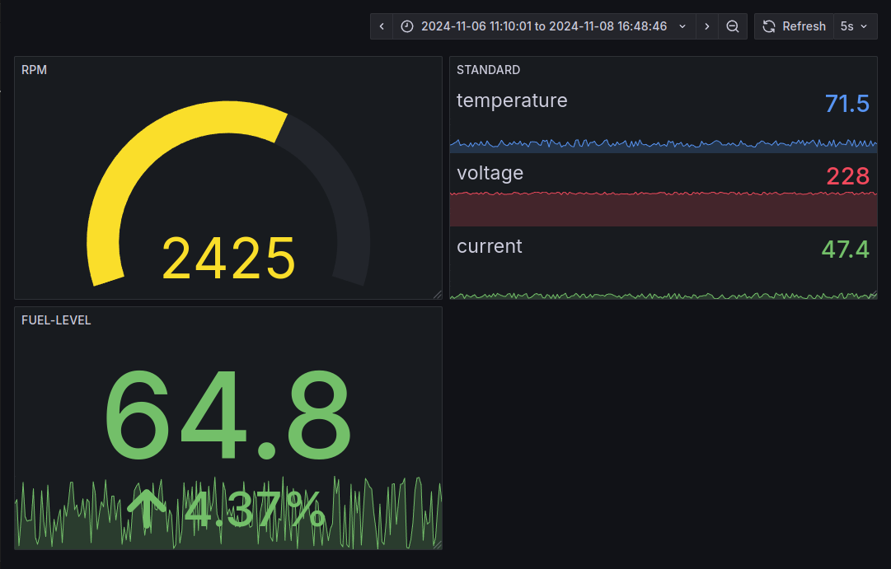

# 🔄 Kafka Sensor Data Pipeline

[](https://opensource.org/licenses/MIT)
[](https://www.python.org/downloads/)
[](https://kafka.apache.org/)
[](https://www.mysql.com/)
[](https://grafana.com/)

A real-time data pipeline built using Apache Kafka for processing and monitoring sensor data offers a highly efficient and fault-tolerant system. In this architecture, sensor readings are collected through a Kafka producer, which allows sensors or gateways to asynchronously send data to Kafka topics. Kafka ensures high throughput and low latency, even in environments with **millions of messages per second**, thanks to its **ability to scale horizontally** by adding more brokers and partitioning topics for parallel processing. Once the data is ingested, Kafka consumers process it in real-time, ensuring reliable message delivery and enabling complex data transformations. The processed data is then stored in MySQL for historical analysis and querying. Finally, Grafana dashboards visualize the data in real time, providing instant insights and monitoring.

Compared to traditional IoT and MQTT protocols, Kafka offers several key advantages. Kafka’s fault tolerance is one of its most notable features; messages are stored on disk and replicated across multiple brokers, meaning that even if one broker fails, the system can recover without data loss. In contrast, MQTT typically does not offer the same level of replication and durability, relying on Quality of Service (QoS) levels to manage message delivery, which can result in data loss in case of broker failures. Furthermore, Kafka's scalability is superior—by adding more brokers and partitions, Kafka can seamlessly handle higher data loads, whereas MQTT often requires complex broker setups to achieve similar scalability. Kafka also provides built-in stream processing capabilities with Kafka Streams and integrates well with various data storage and processing systems, making it much more suitable for large-scale real-time data pipelines than MQTT, which is primarily focused on lightweight messaging and lacks inherent stream processing or advanced data retention features. Additionally, Kafka supports advanced security mechanisms, ensuring data transmission is secure, while MQTT’s security features are more basic.

## 📊 Dashboard Preview


*Real-time monitoring of generator metrics including voltage, current, temperature, fuel level, and RPM*

## 🏗️ System Architecture


## 🚀 Features

- **Real-time Data Generation**: Simulates sensor data including voltage, current, temperature, fuel level, and RPM
- **Kafka Streaming**: Reliable message streaming using Apache Kafka
- **Persistent Storage**: MySQL database for historical data storage
- **Visual Monitoring**: Real-time Grafana dashboards for data visualization
- **Scalable Architecture**: Easy to extend for multiple sensors and data types

## 📋 Prerequisites

- Python 3.8+
- Apache Kafka
- MySQL Server
- Grafana
- Required Python packages:
  ```
  kafka-python
  mysql-connector-python
  ```

## 🛠️ Installation & Setup

1. **Clone the Repository**
   ```bash
   git clone https://github.com/yourusername/Kafka-Sensor-DataPipeline.git
   cd Kafka-Sensor-DataPipeline
   ```

2. **Install Dependencies**
   ```bash
   pip install kafka-python mysql-connector-python
   ```

3. **Configure MySQL Database**
   ```sql
   CREATE DATABASE sensor_data;
   USE sensor_data;
   
   CREATE TABLE generator_data (
       timestamp TIMESTAMP DEFAULT CURRENT_TIMESTAMP,
       voltage FLOAT,
       current FLOAT,
       temperature FLOAT,
       fuel_level FLOAT,
       rpm FLOAT
   );
   ```

4. **Update Configuration**
   - In `producer.py` and `consumer.py`, update:
     - Kafka broker address
     - MySQL connection details
     - Topic name if needed

## 💻 Usage

1. **Start the Kafka Producer**
   ```bash
   python producer.py
   ```
   This will start generating simulated sensor data.

2. **Start the Kafka Consumer**
   ```bash
   python consumer.py
   ```
   This will begin consuming messages and storing them in MySQL.

3. **Configure Grafana Dashboard**
   - Add MySQL as a data source in Grafana
   - Import the provided dashboard JSON
   - Access the dashboard at `http://localhost:3000`

## 📊 Data Format

The sensor data is transmitted in JSON format:
```json
{
    "voltage": 230.45,      // Voltage in volts
    "current": 25.67,       // Current in amps
    "temperature": 75.89,   // Temperature in Celsius
    "fuel_level": 85.43,    // Fuel level percentage
    "rpm": 2500            // Rotations per minute
}
```

## 🔍 Monitoring

The Grafana dashboard provides real-time visualization of:
- Voltage trends
- Current consumption
- Temperature variations
- Fuel level monitoring
- RPM statistics

## 🤝 Contributing

1. Fork the repository
2. Create your feature branch (`git checkout -b feature/AmazingFeature`)
3. Commit your changes (`git commit -m 'Add some AmazingFeature'`)
4. Push to the branch (`git push origin feature/AmazingFeature`)
5. Open a Pull Request

## 📄 License

This project is licensed under the MIT License - see the [LICENSE](LICENSE) file for details.

---

Made with ❤️ by [Sethuram](https://github.com/Sethuram2003)
